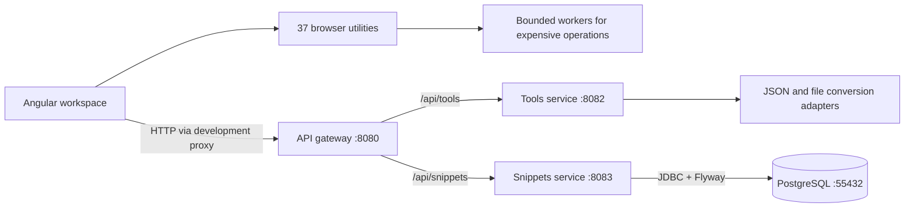

<div align="center">

# ⚓ DevDock

**Everyday developer tools. One organized workspace.**

Format, inspect, convert, compare, and generate — with clear instructions and real results.


[Quick start](#quick-start) · [Tool catalog](#tool-catalog) · [File conversion](#file-conversion) · [Architecture](#architecture) · [API](#api) · [Testing](#testing)

</div>

---

DevDock is a developer toolbox built with Angular and independent Spring Boot services. Its searchable landing page organizes **39 tools into six collections**, with favorites, responsive workspaces, examples, and input/output guidance.

- **37 browser tools** process your inputs locally, including JSON/YAML conversion, regex, diffs, SQL formatting, cryptography, and encoding utilities.
- **JSON Formatter + snippets** connects strict formatting/minification to a persistent library: save, reopen, edit, and delete documents stored in PostgreSQL.
- **File Converter** checks uploaded content, offers compatible formats, and produces real downloads. It supports **30 input formats** and **24 output extensions**, subject to the matrix below.

> **Current scope:** a working local MVP. Authentication is not implemented, so snippets belong to one shared workspace. File uploads are processed by the local tools service and are not kept as conversion history. Services bind to loopback by default.

## Quick start

### 1. Prerequisites

| Requirement | Version / purpose |
|---|---|
| Java | JDK 21+; source targets Java 21. Verified with Java 26.0.2. |
| Node.js | Angular's installed build package requires `^22.22.3`, `^24.15.0`, or `>=26.0.0`. Verified with Node 26.8.2. |
| npm | Included with Node; project package-manager declaration is npm 11.19.1. |
| PostgreSQL | 16+; make `initdb`, `pg_ctl`, `psql`, and `createdb` available on `PATH`. |
| Python | 3.9+ for local database and integration helpers. |
| Git | To clone the repository. |

Commands below use a macOS/Linux shell. Windows users can use WSL with the prerequisites installed inside WSL. Maven is supplied by the checked-in wrapper; Docker and external file-conversion CLIs are not required.

### 2. Clone, initialize the database, and build

```sh
git clone https://github.com/adem-benneji/devdock.git
cd devdock
python3 scripts/local-db.py start
./gateway-service/mvnw -B -ntp -f pom.xml verify
```

The helper creates an isolated PostgreSQL cluster in `.local/postgres`, listening on `127.0.0.1:55432`, with database `devdock_snippets` and role `devdock`. It uses trust authentication for this local development cluster. Flyway creates the snippets schema automatically. Starting the helper again reuses its existing data.

On macOS, the helper also recognizes PostgreSQL 16 binaries under the standard Homebrew installation paths. Add PostgreSQL's `bin` directory to `PATH` for the integration runner, which invokes `psql` directly.

### 3. Start the three services

Open **three terminals** in the repository root and run one command per terminal:

**Tools service**

```sh
java -jar tools-service/target/tools-service-0.0.1-SNAPSHOT.jar
```

**Snippets service**

```sh
java -jar snippets-service/target/snippets-service-0.0.1-SNAPSHOT.jar
```

**API gateway**

```sh
java -jar gateway-service/target/gateway-service-0.0.1-SNAPSHOT.jar
```

### 4. Start the frontend

In a fourth terminal:

```sh
cd frontend
npm ci
npm start
```

Open **[http://localhost:4200](http://localhost:4200)**.

| Page | Path |
|---|---|
| Landing page, search, and collections | `/` |
| Complete tool catalog | `/tools` |
| JSON editor and saved snippets | `/tools/json-formatter` |
| File upload, conversion, and download | `/tools/file-converter` |

Angular's development proxy forwards `/api/**` to the gateway on port 8080.

### 5. Stop or restart

Press `Ctrl+C` in each application terminal. Stop the database with:

```sh
python3 scripts/local-db.py stop
```

To check its state, run `python3 scripts/local-db.py status`. Database files survive stopping the cluster; restarting does not erase saved snippets.

## Tool catalog

Each tool explains what to enter, what action to take, and what output to expect. Browser utilities share example loading, validation, result copying, and stale-result clearing. Favorites remember tool IDs in browser storage.

<details>
<summary><strong>Browse all 39 implemented tools</strong></summary>

| Collection | Tool | What it does |
|---|---|---|
| Data & formats | **File Converter** | Drop a file, discover compatible formats, and download a real conversion. |
| Data & formats | **JSON Formatter** | Bring structure to the chaos. Format, validate, and minify your JSON. |
| Data & formats | **Base64 Encoder** | Encode and decode text, with full support for Unicode. |
| Data & formats | **JSONPath Tester** | Find the nodes you need. Query JSON with paths, wildcards, and slices. |
| Data & formats | **JSON to TypeScript** | Turn a sample payload into a useful TypeScript starting point. |
| Data & formats | **JSON Schema Generator** | Infer a JSON Schema from your sample data, ready to refine. |
| Data & formats | **CSV ↔ JSON** | Move between spreadsheet rows and JSON records with clear column rules. |
| Data & formats | **YAML ↔ JSON** | Convert configuration data between YAML and JSON, right in your browser. |
| Data & formats | **Number Base Converter** | Convert integers between decimal, hexadecimal, binary, and octal. |
| Data & formats | **JSON Diff** | Compare structured documents and pinpoint changed values. |
| Data & formats | **JSON Lines** | Move between newline-delimited JSON and ordinary arrays. |
| Data & formats | **JSON Flatten** | Flatten JSON into reversible paths without losing array types. |
| Data & formats | **JSON String Escape** | Turn text into a quoted JSON string, or recover the original. |
| Data & formats | **UTF-8 Hex Converter** | Explore text as hex bytes and decode UTF-8 byte sequences. |
| Data & formats | **JSON Schema Validator** | Check JSON against a schema and locate validation errors. |
| Data & formats | **SQL Formatter** | Format SQL for PostgreSQL, MySQL, SQLite, SQL Server, or standard SQL. |
| Data & formats | **Gzip / Deflate** | Compress text to Base64 or restore compressed UTF-8 data. |
| Security | **SHA Hash Generator** | Turn text into a SHA-256, SHA-384, or SHA-512 digest. Every character counts. |
| Security | **JWT Decoder** | Inspect token headers, claims, and expiration. Decoding only. |
| Security | **HMAC Signer** | Sign UTF-8 messages and verify hexadecimal HMAC signatures. |
| Security | **PKCE Generator** | Generate OAuth PKCE verifiers and derive S256 challenges. |
| Web & URLs | **URL Encoder** | Encode a URL component or decode those percent signs. |
| Web & URLs | **URL Parser** | Break a web address into its path, query parameters, and fragment. |
| Web & URLs | **HTML Entities** | Encode special characters or decode named and numeric entities. |
| Web & URLs | **Slug Generator** | Turn a title into a clean, Unicode-friendly URL slug. |
| Web & URLs | **IPv4 CIDR Calculator** | Inspect subnet boundaries and check address membership. |
| Web & URLs | **URL Query Editor** | Edit repeated query parameters or remove common tracking keys. |
| Generators | **UUID Generator** | A fresh batch of random v4 UUIDs, ready for your next project. |
| Generators | **Password Generator** | Create a random password using browser cryptographic randomness. |
| Generators | **Semantic Version Toolkit** | Inspect, increment, compare, and match semantic versions. |
| Date & time | **Unix Timestamp** | Go from epoch to everyday. Convert timestamps and UTC dates. |
| Text | **Case Converter** | Switch between camelCase, snake_case, kebab-case, and more. |
| Text | **Word Counter** | Count words, characters, lines, and estimated reading time. |
| Text | **Markdown Table Generator** | Turn CSV rows into a table for your README or documentation. |
| Text | **Line Toolkit** | Deduplicate, sort, reverse, trim, and clean up your lists. |
| Text | **Regex Tester** | Find matches, inspect capture groups, and try replacements. |
| Text | **Text Diff** | See added, removed, and unchanged lines between two versions. |
| Text | **Unicode Inspector** | Inspect characters, code points, bytes, and normalization forms. |
| Text | **Line Endings** | Inspect and convert newline styles or remove a leading BOM. |

</details>

The JSON Formatter runs on the tools service, preserving numeric precision and rejecting duplicate keys. Its snippet library supports refresh persistence, version-conflict handling, and unsaved-edit navigation protection. JWT decoding only inspects a token; it does not verify its signature. Expensive browser operations use disposable workers with timeouts.

## File conversion

**Choose or drop one file → inspect its content → select a compatible output → convert → download.**

File extensions are hints, not the sole detection mechanism. A PNG named `.jpg` is still recognized as PNG; an XLSX renamed `.zip` is still recognized as a workbook. Ambiguous text formats use validated syntax and extension hints.

| Input family | Supported inputs | Available results |
|---|---|---|
| Developer data | JSON, YAML, TOML, XML, ENV, INI | JSON/YAML; TOML, XML, ENV, and INI when the data is representable. Flat record arrays can become CSV, TSV, or XLSX. |
| Spreadsheets | CSV, TSV, XLS, XLSX | JSON/YAML and eligible CSV/TSV/XLSX output. Export one selected sheet as displayed text and cached formula values. |
| Images | PNG, JPG, WEBP, GIF, BMP, TIFF | PNG, JPG, BMP, TIFF, or a one-image PDF. Optional proportional downscaling and JPEG quality. |
| PDF | PDF | Extract text, or render pages as PNG/JPG files inside a ZIP. |
| Text documents | DOCX, TXT, Markdown, HTML | DOCX → TXT/HTML/Markdown; TXT → HTML/Markdown; Markdown → HTML; HTML → TXT. |
| Archives | ZIP, 7Z, TAR, TAR.GZ, TAR.BZ2, TAR.XZ | Convert to any of the other five containers, preserving entry names and bytes within limits. |
| Compressed streams | GZ, BZ2, XZ | Extract the original bytes as `.bin`; compressed TAR content is detected and offers archive conversion instead. |

Aliases such as JPEG/JPG, TIF/TIFF, and TGZ/TAR.GZ count as one format. Outputs depend on actual content; not every listed input can become every listed output.

<details>
<summary><strong>Data mapping and fidelity</strong></summary>

- XML uses one named root, `@attribute` keys, `#text` for leaf text, and arrays for repeated child elements. For example, `<user id="001">Ada</user>` becomes `{"user":{"@id":"001","#text":"Ada"}}`. Values become strings. Namespaces, mixed content, interleaved child groups, DTDs, and external entities are rejected. Comments and formatting are omitted; singleton arrays and empty objects cannot retain their JSON types through XML.
- ENV exports require flat string assignments. INI also permits one level of named sections. Values stay literal, without variable or escape expansion. Multiline values and values containing both quote styles cannot be exported in this dialect. Configuration downloads are not shell scripts.
- Spreadsheet output does not retain formulas, styles, charts, or macros. A workbook's first sheet must be readable before inspection can offer other sheets. CSV/TSV exports neutralize formula-like cells; XLSX writes string cells.
- Image conversion uses the first frame/page, removes metadata, and preserves pixel orientation as encoded. JPEG/BMP flatten transparency onto white. WEBP is currently input-only.
- PDF text extraction needs an existing text layer. DOCX exports text rather than reconstructing the original layout. Archive metadata, permissions, encryption, and links are not preserved.

</details>

| Resource | Current limit |
|---|---|
| File upload | 5 MB, one file at a time |
| Text | 500 KB; structured data depth up to 64 |
| Output / expanded archive content | 20 MB |
| Archives | 200 entries, safe relative paths; conflicting paths and unsupported entries rejected |
| XZ / 7Z LZMA decoder memory | 64 MiB; this is a codec limit, not a whole-process memory quota |
| Images | 12 megapixels, maximum 12,000 pixels per side |
| PDFs | 10 pages; page rendering at 72 DPI |
| Tables / workbooks | 5,000 data rows × 100 columns; up to 50 sheets |
| File operations | Two concurrent operations per tools-service instance |

**Not yet implemented:** audio/video conversion, presentation/e-book conversion, full Office rendering, PDF→Word/OCR, ODS and full workbook fidelity, HEIC/HEIF/AVIF/SVG/ICO, WEBP output, animation preservation, RAR, and background conversion jobs. Planned sections are labeled in the interface. Browser cancellation does not guarantee interruption of an already-running server parser.

## Architecture



| Component | Responsibility | Storage |
|---|---|---|
| Angular 22 | Discovery, collections, favorites, browser utilities, snippet and conversion interfaces | Favorite IDs in local storage; current inputs/results in memory |
| Spring Cloud Gateway | Routing, CORS, request-size limits, downstream error translation | None |
| Tools service | Strict JSON formatting and bounded file inspection/conversion | None; uploads are transient |
| Snippets service | Document CRUD, validation, title uniqueness, optimistic concurrency | Owns PostgreSQL `snippets` table |

Services do not share database access or call each other. The frontend coordinates the user's workflow through their APIs. Conversion logic lives in format adapters; the gateway contains no conversion logic. The configured `/api/auth/**` route is a placeholder without an implemented authentication service.

Snippet records contain a UUID, title, content, language (`JSON` or `TEXT`), version, and timestamps. Flyway manages the schema; title uniqueness is currently case-insensitive across the shared workspace, and version checks prevent silent overwrites.

### Repository layout

```text
devdock/
├── frontend/                 Angular application, browser engines, and UI tests
│   ├── src/app/catalog/      Tool registry and favorites
│   ├── src/app/home/         Landing page, search, cards, and collections
│   ├── src/app/utilities/    Browser tools, usage guides, and workers
│   ├── src/app/files/        File-conversion workspace
│   └── e2e/                  Real browser workflows and outage tests
├── gateway-service/          Reactive API gateway and Maven wrapper
├── tools-service/            JSON processing and file-format adapters
├── snippets-service/         JDBC persistence, REST API, and Flyway migrations
├── scripts/
│   ├── local-db.py           Start/stop the local PostgreSQL cluster
│   └── verify-integration.py Isolated real-service and browser verification
├── pom.xml                   Backend Maven reactor
├── .gitignore                Local/generated and internal-file exclusions
└── README.md                 Public project guide
```

## API

Send application requests through **`http://localhost:8080`**.

| Method | Endpoint | Purpose |
|---|---|---|
| GET | `/api/tools` | Server JSON tool catalog; browser tools live in the frontend registry |
| POST | `/api/tools/json-formatter` | Validate and format/minify JSON |
| GET | `/api/tools/files/capabilities` | Available/planned file sections and size limits |
| POST | `/api/tools/files/inspect?filename=...` | Detect content and return compatible outputs |
| POST | `/api/tools/files/convert?filename=...&target=...` | Convert uploaded bytes and return an attachment |
| GET | `/api/snippets?limit=20&offset=0` | Paginated snippet summaries |
| POST | `/api/snippets` | Create a saved snippet |
| GET | `/api/snippets/{id}` | Read a saved snippet |
| PUT | `/api/snippets/{id}` | Update using the current `version` |
| DELETE | `/api/snippets/{id}?version=...` | Delete using the current `version` |

Format a JSON document:

```sh
curl http://localhost:8080/api/tools/json-formatter \
  -H 'Content-Type: application/json' \
  -d '{"input":"{\"name\":\"DevDock\"}","mode":"FORMAT"}'
```

For file endpoints, send raw bytes with `Content-Type: application/octet-stream`, not multipart or Base64:

```sh
curl 'http://localhost:8080/api/tools/files/inspect?filename=data.json' \
  -H 'Content-Type: application/octet-stream' \
  --data-binary @data.json

curl 'http://localhost:8080/api/tools/files/convert?filename=data.json&target=yaml' \
  -H 'Content-Type: application/octet-stream' \
  --data-binary @data.json \
  --output data.yaml
```

Use an output ID returned by inspection. Image options are `width` (0 keeps the original width) and `quality` (JPEG, 1–100); `sheet` selects a zero-based worksheet. Conversion validates the content and target again. Responses use safe attachment names, correct MIME types, `no-store`, and `nosniff`.

Errors use a consistent `{code,message,fields}` envelope with meaningful HTTP status codes, including invalid input (400), missing resources (404), conflicts (409), oversized input (413), unsupported media (415), incompatible output (422), busy converter (429), unavailable service (503), and gateway timeout (504).

## Configuration

| Variable | Used by | Default |
|---|---|---|
| `SERVER_ADDRESS` | Each Java service | `127.0.0.1` |
| `SERVER_PORT` | Each Java service | Gateway `8080`, tools `8082`, snippets `8083` |
| `TOOLS_SERVICE_URL` | Gateway | `http://127.0.0.1:8082` |
| `SNIPPETS_SERVICE_URL` | Gateway | `http://127.0.0.1:8083` |
| `FRONTEND_ORIGIN` | Gateway CORS | `http://localhost:4200` |
| `SNIPPETS_DB_URL` | Snippets | `jdbc:postgresql://127.0.0.1:55432/devdock_snippets` |
| `SNIPPETS_DB_USER` | Snippets | `devdock` |
| `SNIPPETS_DB_PASSWORD` | Snippets | Empty for the local trust-authenticated cluster |

Set environment variables in the terminal that starts the relevant process. `.env` files are ignored by Git but are **not automatically loaded** by these startup commands. If you change the frontend host/port, set `FRONTEND_ORIGIN` to that exact origin when starting the gateway. If you change the gateway port, update `frontend/proxy.conf.json` too.

Each Java service exposes `/actuator/health` on its own port. The gateway accepts request bodies up to 8 MB and uses a 10-second downstream response timeout; the file service applies its stricter 5 MB upload limit.

## Testing

With PostgreSQL running, execute from the repository root:

```sh
./gateway-service/mvnw -B -ntp -f pom.xml verify
cd frontend
npm ci
npm run build
npm test -- --watch=false
npx playwright install chromium
cd ..
python3 scripts/verify-integration.py
```

| Verification | Latest completed development-cycle result |
|---|---|
| Backend | **87 passing cases**: 5 gateway, 75 tools, 7 snippets |
| Frontend unit tests | **70 passed** |
| Chromium integration | **64 passed**: 62 normal workflows and 2 actual service-outage scenarios |
| Final file-converter browser retest | **11 passed** against the refreshed local preview |
| Production frontend build | Passed; approximately **300 KB** initial bundle, original budgets retained |

The integration runner starts real services and Angular on temporary ports, creates a private PostgreSQL schema, tests persistence across process restarts, conflicts, CORS, request limits, and downstream failure/recovery, then runs Chromium and cleans up its own processes/schema. Conversion tests use real files; Python independently reads and writes compressed archive fixtures.

- `python3 scripts/verify-integration.py --no-browser` runs the backend integration checks.
- `TEST_DB_URL` (JDBC URL), `TEST_DB_USER`, and `TEST_DB_PASSWORD` override test database settings. The test role needs permission to create schemas.
- `--postgres-data /absolute/path/to/cluster` additionally stops/restarts that cluster to check outage recovery. Use this option only with a dedicated test database.

### Troubleshooting

| Symptom | What to check |
|---|---|
| PostgreSQL command not found | Add PostgreSQL's `bin` directory to `PATH`; check `initdb`, `pg_ctl`, `psql`, and `createdb`. |
| A port is already in use | Check for an existing DevDock process. Use matching service URLs/proxy settings if choosing other ports. |
| Snippets service cannot start | Start PostgreSQL and confirm the database URL, role, and port. |
| Browser receives 403/CORS errors | Match `FRONTEND_ORIGIN` to the exact browser origin, including hostname and port. |
| API returns 503 | Check that the downstream tools/snippets service is running; inspect its health endpoint. |
| A conversion is unavailable | Select one of the outputs returned by inspection; check format fidelity and size limits above. |
| Integration tests cannot find Chromium | Run `npx playwright install chromium` from `frontend/`. |

## Development direction

The next file-conversion milestone is isolated, cancellable execution with enforced resource/time limits and a real Office or media engine. Broader product work includes authentication/private snippet ownership, saved browser-tool workflows, and automated API contracts. Deployment is intentionally outside the current scope.

The repository keeps application source, tests, build configuration, migrations, dependency lockfiles, and local development scripts. Internal agent instructions, planning/report documents, editor metadata, local databases, credentials, dependencies, and generated artifacts are excluded; this README is the public documentation entry point.
