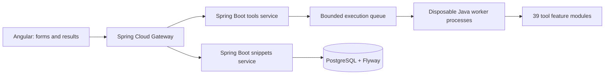

<div align="center">

# DevDock

**Your developer toolkit — powered by Spring Boot.**

39 focused tools · Real backend APIs · PostgreSQL snippets · Cancellable file conversion

[Start locally](#quick-start) · [Tools](#tool-catalog) · [Architecture](#architecture) · [API contracts](#api-contracts) · [Contributing a tool](#adding-a-tool)

</div>

---

DevDock brings formatting, conversion, inspection, cryptography, and text utilities into one searchable workspace. Every tool explains its input, action, and output, with examples you can run. Angular manages forms and results; **all tool processing runs in Java on the backend**.

## Quick start

Install **Java 21 LTS**, **Node.js 22.22.3+ / 24.15+ / 26+** (Angular 22's supported versions), **Python 3**, and **PostgreSQL 16+**. Maven is included in `backend/mvnw`. On macOS, the development script discovers Homebrew's Java 21 and PostgreSQL 16 installations.

```bash
# From the repository root:
make doctor
make dev
```

Open **http://127.0.0.1:4200**. `make dev` starts a local PostgreSQL cluster if needed, runs backend tests, builds Angular, and starts the three services plus the frontend. The first run downloads Maven/npm dependencies. The frontend uses a development proxy to the gateway.

```bash
make status       # Managed process state and ports
make logs         # Recent service and frontend logs
make stop         # Stop managed app processes; retain database and data
make build        # Backend tests/package + frontend production build
make check        # Builds, module checks, contract types, unit tests, real browser integration
make format       # Consistent Java formatting (use Java 21)
```

For browser checks, install Chromium once:

```bash
cd frontend
npx playwright install chromium
cd ..
make check
```

### Configuration

Copy `.env.example` to `.env` for overrides. `scripts/dev.py` loads literal values; it never evaluates shell expressions. Explicit shell environment variables take precedence. Manual `java -jar` commands do not load `.env`.

| Setting | Default | Purpose |
|---|---|---|
| `JAVA_HOME` | Existing environment or discovered Homebrew Java 21 | Consistent compiler and worker runtime |
| `FRONTEND_PORT` | `4200` | Angular development server |
| `GATEWAY_SERVICE_PORT` | `8080` | API entry point |
| `TOOLS_SERVICE_PORT` | `8082` | Tools and execution lifecycle |
| `SNIPPETS_SERVICE_PORT` | `8083` | Persisted snippets |
| `DB_PORT` | `55432` | Local PostgreSQL |
| `DB_DATA_DIR` | `.local/postgres` | Local cluster directory |
| `SNIPPETS_DB_URL` | Local `devdock_snippets` database | Explicit value uses an external database |
| `SNIPPETS_DB_USER` / `SNIPPETS_DB_PASSWORD` | `devdock` / empty | Local database credentials |
| `TEST_DB_URL`, `TEST_DB_USER`, `TEST_DB_PASSWORD` | Local database / `devdock` / empty | Test connection; suites create disposable schemas |

Services bind to loopback. Occupied app ports produce an error; the script never kills unrelated processes. The database helper uses trust authentication for this local-only cluster. `make stop` leaves PostgreSQL running; `make db-stop` stops the default helper-managed cluster without deleting data. For an existing cluster, use its `DB_DATA_DIR` or a database URL. Tests never clear application tables.

## Architecture



| Component | Owns | Storage |
|---|---|---|
| Gateway | Routing, CORS, request limits, downstream error translation | None |
| Tools service | Validation, all tool engines, conversion adapters, bounded jobs and cancellation | Private temporary job files; no tool history database |
| Snippets service | JSON/text snippets, optimistic concurrency, and pagination | Its own PostgreSQL tables and migrations |
| Frontend | Discovery, favorites, tool forms, help/examples, status, copying/downloads | Favorite IDs in browser storage; current workspace in memory |

The 37 migrated utility engines and file parsers run in child JVMs. The small streaming JSON formatter retains its bounded synchronous API. Long jobs return `202` immediately and are polled, keeping them independent of the gateway's 10-second response timeout. Legacy synchronous file endpoints use the same worker pool and cancel after 8 seconds.

Jobs return an unguessable capability token; status, download, and deletion require `X-Execution-Token`. Tokens are not sent in URLs. Input files are deleted when processing finishes; the frontend deletes results after consuming them. Unclaimed results expire after two minutes. Cancellation kills the running JVM or removes queued work. Worker heap and deadlines are bounded; **this is process separation, not a complete operating-system security sandbox**. Jobs are ephemeral and do not survive a service restart.

### Project structure

```text
backend/
  pom.xml, mvnw, .mvn/          Shared dependency versions and Maven wrapper
  gateway-service/             Routing and HTTP policies
  snippets-service/            API, JDBC repositories, Flyway migrations
  tools-service/src/
    main/java/com/devtools/tools/
      features/
        base64/Base64Tool.java
        regextester/RegexTesterTool.java
        jsonformatter/         Streaming formatter and endpoint
        fileconverter/         File endpoint and format adapters
        ...                    One folder per tool (39 total)
      execution/               Queue, lifecycle API and disposable worker entry point
      utilities/               Tool interface, registry and common validation
      shared/                  Small reusable Unicode/URL/crypto helpers
    main/resources/tools/<tool-id>/definition.json
    test/java/com/devtools/tools/features/<tool>/
    test/resources/tools/<tool-id>/examples.json
frontend/src/app/
  features/<tool-id>/           Each tool's configuration and usage guide
  features/json-formatter/     Dedicated snippet workspace
  features/file-converter/     Dedicated upload/conversion workspace
  utilities/                   Reusable tool form; API adapter, no tool engines
  shared/                      Execution lifecycle client and UI primitives
  generated/                   Types generated from Spring OpenAPI contracts
contracts/                     Reviewed OpenAPI snapshots
scripts/                       Development, database and verification commands
tooling/contracts/             Isolated OpenAPI generator dependencies (TypeScript 5)
```

## Tool catalog

Every operation uses a real backend. Favorites and presentation state remain in the browser. Input, including secrets used by cryptography tools, is sent to your configured DevDock backend; the UI no longer claims browser-only processing.

| Category | Tool | Purpose |
|---|---|---|
| Data & formats | **File Converter** | Drop a file, discover compatible formats, and download a real conversion. |
| Data & formats | **JSON Formatter** | Bring structure to the chaos. Format, validate, and minify your JSON. |
| Data & formats | **Base64 Encoder** | Encode and decode text, with full support for Unicode. |
| Data & formats | **JSONPath Tester** | Find the nodes you need. Query JSON with paths, wildcards, and slices. |
| Data & formats | **JSON to TypeScript** | Turn a sample payload into a useful TypeScript starting point. |
| Data & formats | **JSON Schema Generator** | Infer a JSON Schema from your sample data, ready to refine. |
| Data & formats | **CSV ↔ JSON** | Move between spreadsheet rows and JSON records with clear column rules. |
| Data & formats | **YAML ↔ JSON** | Convert configuration data between YAML and JSON, on the Spring Boot backend. |
| Data & formats | **Number Base Converter** | Convert integers between decimal, hexadecimal, binary, and octal. |
| Data & formats | **JSON Diff** | Compare structured documents and pinpoint changed values. |
| Data & formats | **JSON Lines** | Move between newline-delimited JSON and ordinary arrays. |
| Data & formats | **JSON Flatten** | Flatten JSON into reversible paths without losing array types. |
| Data & formats | **JSON String Escape** | Turn text into a quoted JSON string, or recover the original. |
| Data & formats | **UTF-8 Hex Converter** | Explore text as hex bytes and decode UTF-8 byte sequences. |
| Data & formats | **JSON Schema Validator** | Check JSON against a schema and locate validation errors. |
| Data & formats | **SQL Formatter** | Format SQL for PostgreSQL, MySQL, SQLite, SQL Server, or standard SQL. |
| Data & formats | **Gzip / Deflate** | Compress text to Base64 or restore compressed UTF-8 data. |
| Security | **SHA Hash Generator** | Turn text into a SHA-256, SHA-384, or SHA-512 digest. Every character counts. |
| Security | **JWT Decoder** | Inspect token headers, claims, and expiration. Decoding only. |
| Security | **HMAC Signer** | Sign UTF-8 messages and verify hexadecimal HMAC signatures. |
| Security | **PKCE Generator** | Generate OAuth PKCE verifiers and derive S256 challenges. |
| Web & URLs | **URL Encoder** | Encode a URL component or decode those percent signs. |
| Web & URLs | **URL Parser** | Break a web address into its path, query parameters, and fragment. |
| Web & URLs | **HTML Entities** | Encode special characters or decode named and numeric entities. |
| Web & URLs | **Slug Generator** | Turn a title into a clean, Unicode-friendly URL slug. |
| Web & URLs | **IPv4 CIDR Calculator** | Inspect subnet boundaries and check address membership. |
| Web & URLs | **URL Query Editor** | Edit repeated query parameters or remove common tracking keys. |
| Generators | **UUID Generator** | A fresh batch of random v4 UUIDs, ready for your next project. |
| Generators | **Password Generator** | Create a random password using Java SecureRandom. |
| Generators | **Semantic Version Toolkit** | Inspect, increment, compare, and match semantic versions. |
| Date & time | **Unix Timestamp** | Go from epoch to everyday. Convert timestamps and UTC dates. |
| Text | **Case Converter** | Switch between camelCase, snake_case, kebab-case, and more. |
| Text | **Word Counter** | Count words, characters, lines, and estimated reading time. |
| Text | **Markdown Table Generator** | Turn CSV rows into a table for your README or documentation. |
| Text | **Line Toolkit** | Deduplicate, sort, reverse, trim, and clean up your lists. |
| Text | **Regex Tester** | Find matches, inspect capture groups, and try replacements. |
| Text | **Text Diff** | See added, removed, and unchanged lines between two versions. |
| Text | **Unicode Inspector** | Inspect characters, code points, bytes, and normalization forms. |
| Text | **Line Endings** | Inspect and convert newline styles or remove a leading BOM. |

JWT decoding does not verify signatures. Regex uses Java's engine with UTF-16 offsets and the documented replacement syntax. JSON uses precise backend numeric parsing; generated JavaScript/TypeScript number types still require review. SQLite SQL formatting uses the standard SQL formatter rather than a complete SQLite grammar.

## File conversion

**Choose or drop one file → inspect its content → select a compatible output → convert → download.**

File extensions are hints, not the sole detection mechanism. A PNG named `.jpg` is still recognized as PNG; an XLSX renamed `.zip` is still recognized as a workbook. Ambiguous text formats use validated syntax and extension hints.

| Input family | Supported inputs | Available results |
|---|---|---|
| Developer data | JSON, YAML, TOML, XML, ENV, INI | JSON/YAML; TOML, XML, ENV, and INI when the data is representable. Flat record arrays can become CSV, TSV, or XLSX. |
| Spreadsheets | CSV, TSV, XLS, XLSX | JSON/YAML and eligible CSV/TSV/XLSX output. Export one selected sheet as displayed text and cached formula values. |
| Images | PNG, JPG, WEBP, GIF, BMP, TIFF | PNG, JPG, BMP, TIFF, or a one-image PDF. Optional proportional downscaling and JPEG quality. |
| PDF | PDF | Extract text, or render pages as PNG/JPG files inside a ZIP. |
| Text documents | DOCX, TXT, Markdown, HTML | DOCX → TXT/HTML/Markdown; TXT → HTML/Markdown; Markdown → HTML; HTML → TXT. |
| Archives | ZIP, 7Z, TAR, TAR.GZ, TAR.BZ2, TAR.XZ | Convert to any of the other five containers, preserving entry names and bytes within limits. |
| Compressed streams | GZ, BZ2, XZ | Extract the original bytes as `.bin`; compressed TAR content is detected and offers archive conversion instead. |

Aliases such as JPEG/JPG, TIF/TIFF, and TGZ/TAR.GZ count as one format. Outputs depend on actual content; not every listed input can become every listed output.

<details>
<summary><strong>Data mapping and fidelity</strong></summary>

- XML uses one named root, `@attribute` keys, `#text` for leaf text, and arrays for repeated child elements. For example, `<user id="001">Ada</user>` becomes `{"user":{"@id":"001","#text":"Ada"}}`. Values become strings. Namespaces, mixed content, interleaved child groups, DTDs, and external entities are rejected. Comments and formatting are omitted; singleton arrays and empty objects cannot retain their JSON types through XML.
- ENV exports require flat string assignments. INI also permits one level of named sections. Values stay literal, without variable or escape expansion. Multiline values and values containing both quote styles cannot be exported in this dialect. Configuration downloads are not shell scripts.
- Spreadsheet output does not retain formulas, styles, charts, or macros. A workbook's first sheet must be readable before inspection can offer other sheets. CSV/TSV exports neutralize formula-like cells; XLSX writes string cells.
- Image conversion uses the first frame/page, removes metadata, and preserves pixel orientation as encoded. JPEG/BMP flatten transparency onto white. WEBP is currently input-only.
- PDF text extraction needs an existing text layer. DOCX exports text rather than reconstructing the original layout. Archive metadata, permissions, encryption, and links are not preserved.

</details>

| Resource | Current limit |
|---|---|
| File upload | 5 MB, one file at a time |
| Text | 500 KB; structured data depth up to 64 |
| Output / expanded archive content | 20 MB |
| Archives | 200 entries, safe relative paths; conflicting paths and unsupported entries rejected |
| XZ / 7Z LZMA decoder memory | 64 MiB; this is a codec limit, not a whole-process memory quota |
| Images | 12 megapixels, maximum 12,000 pixels per side |
| PDFs | 10 pages; page rendering at 72 DPI |
| Tables / workbooks | 5,000 data rows × 100 columns; up to 50 sheets |
| Execution pool | Two worker JVMs, 16 queued jobs, 64 retained jobs |
| Worker bounds | 256 MiB Java heap; 10 seconds per utility, 60 seconds per file operation |
| Result retention | Deleted after retrieval by the UI; otherwise expires after 2 minutes |

**Not yet implemented:** audio/video conversion, presentation/e-book conversion, full Office rendering, PDF→Word/OCR, ODS and full workbook fidelity, HEIC/HEIF/AVIF/SVG/ICO, WEBP output, animation preservation, RAR. Planned sections are labeled in the interface. Cancelling or replacing a file deletes its job and terminates its worker JVM.

## API contracts

Spring Boot publishes OpenAPI at `/v3/api-docs` on each domain service. The gateway exposes `/api/contracts/tools` and `/api/contracts/snippets`. Snapshots live in `contracts/`; TypeScript is generated into `frontend/src/app/generated/`. The generator has its own locked toolchain in `tooling/contracts/` so its TypeScript 5 requirement does not constrain Angular’s TypeScript 6. `make build` installs it automatically; manual setup uses `npm ci --prefix tooling/contracts`.

```bash
# With services running at their default ports:
python3 scripts/api-contracts.py
# Fail on live contract drift or stale generated types:
python3 scripts/api-contracts.py --check
# Check types from snapshots without running services:
python3 scripts/api-contracts.py --offline --check
```

| Method | Endpoint | Behavior |
|---|---|---|
| GET | `/api/tools/utilities` | Definitions, modes and input fields for 37 utilities |
| POST | `/api/tools/{toolId}/executions` | Start a utility; JSON `{input, mode, fields}` → `202 {id, token}` |
| POST | `/api/tools/files/executions?operation=inspect&filename=...` | Start inspection of raw octet-stream bytes |
| POST | `/api/tools/files/executions?operation=convert&filename=...&target=...` | Start conversion; optional sheet, width, quality |
| GET | `/api/tools/executions/{id}` | State and result; private token header required |
| GET | `/api/tools/executions/{id}/download` | Download a successful binary result |
| DELETE | `/api/tools/executions/{id}` | Cancel/delete job and temporary files |
| GET | `/api/tools/files/capabilities` | Actual supported file families and limits |
| POST | `/api/tools/json-formatter` | Streaming JSON format/minify |
| GET / POST | `/api/snippets` | List or create snippets |
| GET / PUT / DELETE | `/api/snippets/{id}` | Read, update, delete; mutations check versions |

Validation errors use `{code, message, fields}`. An accepted job reports processing failures in its terminal status rather than returning an HTTP failure for polling. Full queues return `429`. Missing/expired jobs or incorrect tokens return `404`. Job states: `QUEUED`, `RUNNING`, `SUCCEEDED`, `FAILED`, `CANCELLED`, `TIMED_OUT`; a deleted job is no longer retrievable.

## Adding a tool

1. Add `features/<package>/<Name>Tool.java` implementing `ToolProcessor`; keep its business logic there.
2. Register it in `ToolRegistry`. Reuse shared validation/helpers when appropriate.
3. Add `resources/tools/<id>/definition.json` with modes and field limits.
4. Add matching backend tests and example fixtures under that tool's folders.
5. Add frontend `features/<id>/config.ts` and `guide.ts`, register them in the two presentation registries, and add a catalog entry.
6. Run module checks, backend tests, browser integration, and regenerate contracts if the transport changes.

Do not create a new microservice or duplicate the common tool workspace for a new text utility. A service boundary should own a business capability, not a single encoding operation.

## Testing

`make check` uses real Spring Boot services, a real PostgreSQL schema, native Java parsers, isolated JVM jobs and Chromium. The integration runner chooses temporary ports, checks persistence across a snippets-service restart, conflict handling, gateway limits/CORS, service failure/recovery, and browser workflows. It removes only the processes and schema it created.

```bash
# Backend-only end-to-end verification:
python3 scripts/verify-integration.py --no-browser
# Verify per-tool folders, metadata, guides and absence of browser workers:
python3 scripts/check-tool-layout.py
```

Independent example fixtures compare migrated Java results with the previous browser behavior, with explicit adaptations for documented engine differences. Lifecycle tests check actual worker termination, queue saturation, timeouts, token protection, large output transport and file downloads.

Latest verified cycle: **206 backend tests, 4 frontend unit tests, 63 Chromium workflow tests and 3 real outage tests passed**. The Angular production build, per-tool layout check and live/generated contract checks also passed.

## Current limitations

- Snippets are still shared; authentication and account ownership are the next high-value cycle.
- Conversion families marked planned are not implemented. Native conversion tools installed on a developer machine are not automatically exposed as working converters.
- Office layout/formulas, image metadata/animation, and other fidelity limits are described above. Conversions cannot promise lossless output across unrelated formats.
- Workers have bounded JVM resources but are not fully OS-sandboxed. Abrupt termination of the parent process can leave temporary directories that require cleanup.
- Job queues/results are local and ephemeral; there is no persistent execution history or cross-instance scheduling.
- Browser coverage currently targets Chromium; additional engines and sustained concurrency benchmarks remain useful work.

## Deployment

Intentionally deferred. This repository's scripts configure local development only.
